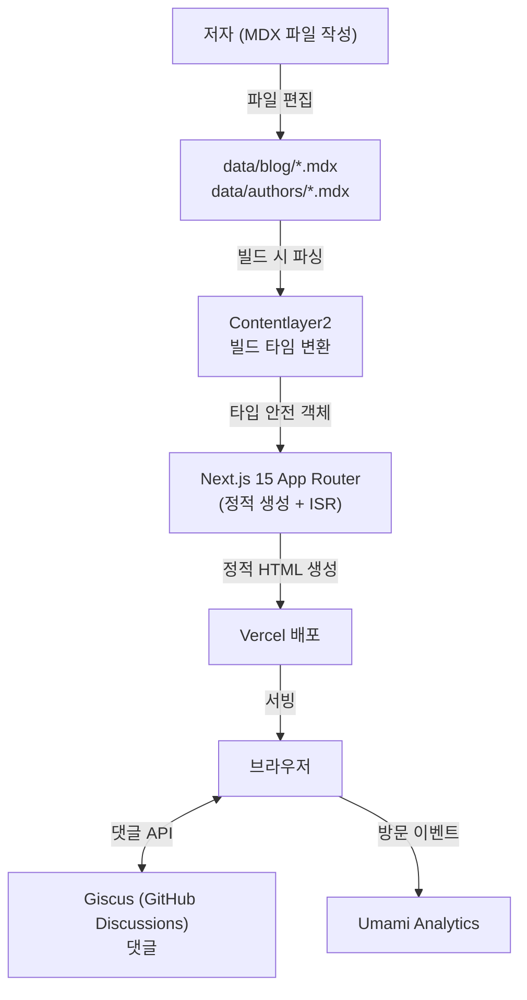

# architecture.md

## 시스템 아키텍처



---

## 구성 요소 설명

| 구성 요소 | 기술 스택 | 역할 |
|---------|---------|------|
| **콘텐츠** | MDX (Markdown + JSX) | 블로그 포스트 및 저자 정보 |
| **콘텐츠 처리** | Contentlayer2 | MDX → TypeScript 객체 변환, 타입 생성 |
| **MDX 파이프라인** | Remark + Rehype 플러그인 | GFM, 수학(KaTeX), 코드 강조(Prism), 인용 처리 |
| **프레임워크** | Next.js 15 (App Router) | 페이지 라우팅, 정적 생성(SSG) |
| **UI** | React 19, Tailwind CSS 4 | 컴포넌트, 스타일링 |
| **테마** | next-themes | 라이트/다크/시스템 테마 |
| **검색** | kbar | 커맨드 팔레트 기반 로컬 검색 |
| **댓글** | Giscus | GitHub Discussions 기반 댓글 |
| **분석** | Umami | 프라이버시 중심 방문자 분석 |
| **배포** | Vercel | CI/CD + CDN |

---

## 데이터 흐름

### 콘텐츠 빌드 타임 처리

```
data/blog/*.mdx
    ↓  (Contentlayer2 빌드)
.contentlayer/generated/Blog/*.json   ← 각 포스트 JSON
    +
app/tag-data.json                     ← { "태그": 개수 }
public/search.json                    ← kbar 검색 인덱스
public/feed.xml                       ← RSS
```

### 런타임 데이터 흐름

```
allBlogs (Contentlayer import)
    → 페이지 컴포넌트에서 필터/정렬
    → ListLayout / PostLayout 렌더링
    → 정적 HTML 서빙 (Vercel Edge)
```

---

## 주요 설정 파일

| 파일 | 역할 |
|------|------|
| `contentlayer.config.ts` | Contentlayer 스키마 및 MDX 플러그인 정의 |
| `next.config.js` | Next.js 설정, CSP 헤더, 이미지 도메인 |
| `data/siteMetadata.js` | 사이트 전역 메타데이터, 분석/댓글/검색 설정 |
| `data/headerNavLinks.ts` | 네비게이션 링크 배열 |
| `data/projectsData.ts` | 프로젝트 카드 데이터 배열 |
| `tailwind.config.*` | Tailwind CSS 설정 |

---

## 환경 변수

| 변수명 | 용도 | 필수 |
|--------|------|------|
| `NEXT_UMAMI_ID` | Umami 사이트 ID | 선택 |
| `NEXT_PUBLIC_GISCUS_*` | Giscus 댓글 설정 | 선택 |
